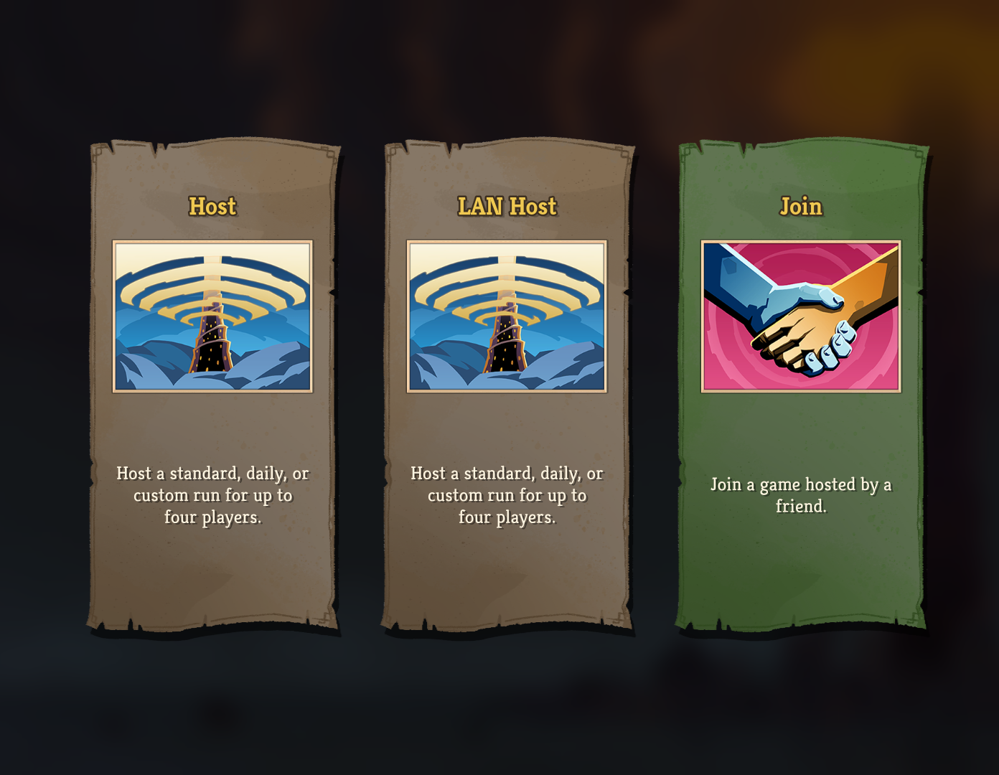
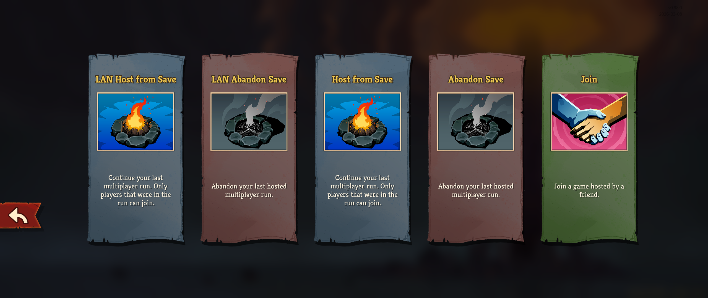
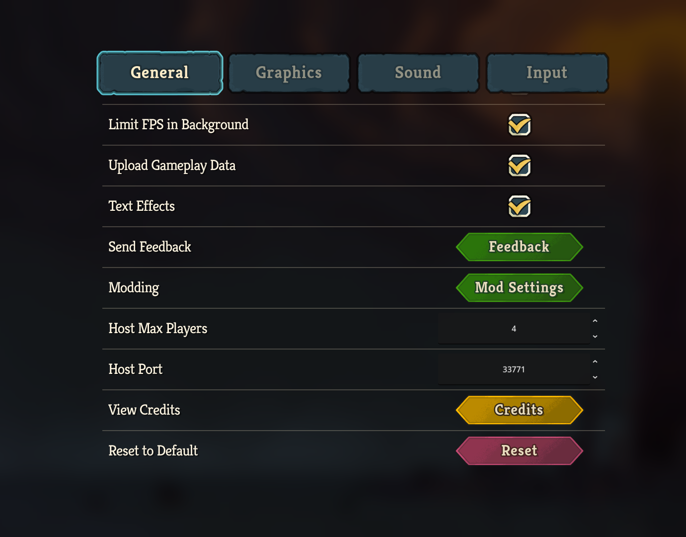

# SlayTheSpire2.LAN.Multiplayer

Used Local network with friends to play Slay The Spire 2 multiplayer.

Tip: You can change player name in the mp_names.json file on each host or client. The host will not synchronize player name to client.

## How Install
Extract the archive to get mods folder then place mods folder into the game directory.

## Screenshot

